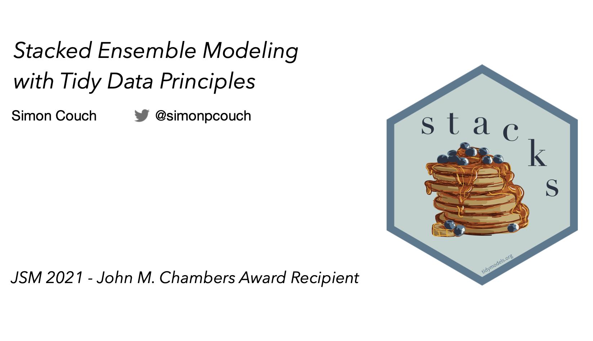

# stacks

Slides for my JSM 2021 talk on `stacks`, a statistical software package which received the 2021 John M. Chambers Award!  

* [Package website](https://stacks.tidymodels.org/)  

* [Package source code](https://github.com/tidymodels/stacks)  

* [Slides](https://github.com/simonpcouch/stacks-jsm-2021/blob/main/slides.pdf)  

* [Alt text](https://raw.githubusercontent.com/simonpcouch/stacks-jsm-2021/main/alt-text.txt)  

